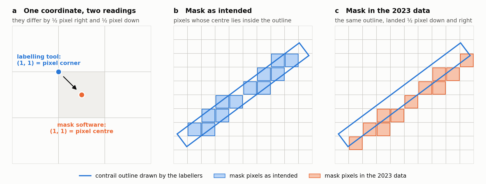

# Competition: Contrail Segmentation
> Aircraft leave condensation trails that spread into thin cirrus and trap outgoing heat. Detecting
> them in satellite imagery is the first step towards routing aircraft around the air that forms
> them. Your job: given one infrared satellite image, predict which pixels are contrail. 🛰️

## Table of Contents
- [The Task](#the-task)
- [The Data](#the-data)
- [The Metric](#the-metric)
- [Submission Format](#submission-format)
- [Getting Started](#getting-started)
- [What We Give You](#what-we-give-you)
- [Submission Rules](#submission-rules)
- [Rules](#rules)
- [Timeline](#timeline)
- [Troubleshooting](#troubleshooting)

## The Task
Each record is a single 256×256 frame from the GOES-16 weather satellite, taken in three infrared
bands, together with a binary mask marking the contrail pixels. You get the masks for the training
records; you predict them for the test records.

The pixels are 2 km across, so the whole frame covers about 512 km. A young contrail is roughly 1 km
wide — narrower than a single pixel — and even an aged, spread-out one is only a few pixels across.
They are thin, faint, linear, and easy to confuse with natural cirrus. That is the problem.

The data comes from **OpenContrails**, Google Research's dataset of GOES-16 contrail labels, which
was also used in their 2023 Kaggle competition *Identify Contrails to Reduce Global Warming*. The
masks were drawn by hand by Google Research's data operations team: several people labelled each
scene, and a pixel counts as contrail when more than half of them agreed.

## The Data
The data is published with the competition on Kaggle. **Do not download it** — attach it to your
notebook: `+ Add Input` → `Competitions`, then this competition. Copy its path from the `Input` panel,
the same way you do for the exercise datasets (see [kaggle.md](../kaggle.md)).

| Split | Records | Masks |
| --- | --- | --- |
| `train` | 6 000 | ✅ provided |
| `test` | 2 000 | ❌ this is what you predict |

The data files are HDF5, sharded so there are a handful of large files rather than thousands of
small ones. Next to them are `sample_submission.csv` and a copy of [metric.py](metric.py):

```
train_000.h5 ... train_002.h5   test_000.h5   sample_submission.csv   metric.py

/id      (N,)              |S12    record id
/bands   (N, 3, 256, 256)  uint16  scaled brightness temperature, bands 11, 14, 15
/mask    (N, 256, 256)     uint8   1 = contrail          (train only)
```

`/bands` is stored as integers to keep the files small. Convert back to brightness temperature in
kelvin with the `scale` and `offset` stored on the dataset:

```python
kelvin = bands.astype(np.float32) * f["bands"].attrs["scale"] + f["bands"].attrs["offset"]
```

> 💡 The three bands are 8.4, 11.2 and 12.3 µm. What you feed your network — the raw temperatures,
> differences between bands, a normalised composite, something else — is your choice, and it is one
> of the cheapest places to gain. Exercise 2 asked you the same question about polarisation channels.

> ⚠️ **Roughly 0.5 % of pixels are contrail.** Train with a plain `BCELoss` and your model will
> quite happily learn to predict nothing at all, and score zero. Every year, everybody hits this in
> week one. Plan for it.

### A note on the labels
If you read the notebooks and write-ups from Google's 2023 Kaggle competition, you will find that its
masks had a known flaw: every mask sat about **half a pixel down and to the right** of its contrail.
The labellers' outlines were stored as coordinates measured from the **corner** of a pixel, and the
software that turned them into pixel masks read those numbers as the **centre** of a pixel (a–c
below). Many solutions from that competition shift their masks or predictions to compensate.



**Do not do that here.** This dataset is built from Google's re-release of March 2025, in which the
masks were redrawn with the right convention: they sit on the contrails. Measured over the training
set, what is left of the offset is a tenth of a pixel or less.

## The Metric
Submissions are scored on the **global Dice coefficient**:

$$\text{Dice} = \frac{2\,|X \cap Y|}{|X| + |Y|}$$

where $X$ is the set of **all** predicted contrail pixels across the **entire** test set, and $Y$ the
set of all ground-truth contrail pixels.

*Global* is the important word. This is not the mean of per-record Dice scores. Over half the records
contain no contrail at all, and averaging per-record scores would be dominated by those empty
records — a model that predicted nothing would score well. Pooling every pixel into one number
instead means predicting nothing scores exactly 0.

> ⚠️ **Choose your threshold on purpose.** How much the cutoff matters depends on your model: after
> training with plain or weighted cross-entropy it can move your score a lot, with losses that push
> probabilities towards 0 and 1 much less.
>
> So we give you the metric. `global_dice()` in [metric.py](metric.py) is the same computation the
> leaderboard runs. Hold out a validation split and choose your threshold on it — that is faster,
> more accurate and less noisy than spending your daily submissions hunting for it.

## Submission Format
A CSV with one row per test record:

```
Id,PredictionString
0a3f19c7b2d1,-
0a41b502e9c4,15129 3 15384 5 15640 4
```

Masks are run-length encoded. Runs are space-delimited `start length` pairs, so `1 3 10 5` means
pixels 1, 2, 3, 10, 11, 12, 13, 14. Pixels are numbered **from 1**, going **top to bottom and then
left to right** — pixel 1 is `(0, 0)`, pixel 2 is `(1, 0)`, pixel 257 is `(0, 1)`. A record with no
predicted contrail is written as `-`.

> ⚠️ That numbering is **column-major** — NumPy's `order="F"`, not the row-major order you get from a
> plain `.flatten()`. Because the masks are square, getting it backwards raises **no error at all**:
> you silently submit the transpose of your mask, which scores well under **0.1**. If your
> leaderboard score is near zero but your validation score is fine, this is why.
>
> Use `rle_encode()` and `write_submission()` from [metric.py](metric.py) and it cannot happen.

## Getting Started
Open [visualize_kaggle.ipynb](visualize_kaggle.ipynb). It attaches the data, reads a few records,
plots them next to their masks, and writes an all-`-` submission.

Submit that empty file first. It scores exactly `0.0000` — which is not a useful model, but it does
prove your whole loop works end to end, and every number after it is about your model rather than
about your file format.

Then go build something.

## What We Give You
✅ The data, the metric, the submission format, and a notebook that reads and plots the data.

❌ Everything else. The `Dataset`, the dataloader, the model, the loss, the augmentation, the
validation split and the threshold are yours to write.

## Submission Rules
To earn the bonus point you need **all three** of the following. They are not weighted or traded off
against each other: missing one means no bonus point.

### 1. Beat the baseline
- Your final submission must score a global Dice above **0.55646** on the **private** leaderboard.
  That is the private score of our reference model. During the competition the leaderboard shows its
  *public* score (0.56501), but the bar is the private one.
- The bar is fixed. It does not move when other students improve.
- Only your two selected final submissions count. If you select none, Kaggle picks your two best
  *public* scores, which is usually not what you want.

### 2. Hand in your notebook and a write-up (by 18 October 2026)
- **The notebook** that produced your final submission, together with your trained model weights. We
  must be able to run it from top to bottom and get your submission back. If we cannot, the
  submission may be considered void.
- **A write-up of 1–2 pages, as a separate PDF**, on your implementation. Do not describe the task; we
  know it. Spend the pages on **what** you did, **why** you chose it and **how** you did it: your input
  representation, model, loss, training, validation and threshold, and what you tried that did not
  work.
- **Your sources:** end the write-up with everything you drew on: notebooks, repositories, papers,
  code from AI assistants (rules 3 and 6 below).
- **Email** both to [q.missinne@tudelft.nl](mailto:q.missinne@tudelft.nl), and include:
  - your **Kaggle username**, so we can match you to your submissions;
  - the **public leaderboard score** of your final submission.

### 3. Discuss your work with us
- An open discussion with the teaching staff about what you built and what you found. We decide what
  to ask.
- Discussions take place on **19–21 October 2026**. If your work is ready earlier, reach out to us and
  we will set up an earlier slot.

## Rules
1. **Work individually.** Discussing ideas and debugging with classmates is encouraged. Sharing code,
   trained weights or submission files is not.
2. **Do not look up the source records.** This dataset is derived from Google's public OpenContrails
   dataset, which also underlies a 2023 Kaggle competition. The record identifiers have been
   regenerated, but the records themselves are public. Trying to recover the original records or their
   labels — by searching the original data, by image matching, by reverse image search, or by any other
   route — is examination fraud under the TU Delft Rules and Guidelines of the Board of Examiners.
3. **You may read; you may not transplant.** That 2023 competition produced a lot of public
   notebooks, write-ups and papers. Read all of it and learn from it. Do not submit a solution you did
   not build and cannot explain. List everything you drew on in your write-up.
4. **Train on the provided training set only.** Pretrained weights are **not allowed**, and neither is
   extra labelled contrail or satellite-segmentation data. The test records must not be used for
   training in any form.
5. **Five submissions per day**, and you select **two** final submissions before the deadline. If you
   select none, Kaggle picks your two best *public* scores, which is usually not what you want.
6. **AI assistants:** the same rule as everywhere else in this course. Use them to learn and to write
   code faster, but understand what comes out. Rule 3 applies to assistant-written code exactly as it
   applies to code from GitHub.

## Timeline
| Date | Event |
| --- | --- |
| 1 October 2026 | Competition opens |
| 18 October 2026 | Final submission deadline, private leaderboard revealed |
| 18 October 2026 | Write-up due |
| 19–21 October 2026 | Discussions |

## Troubleshooting
| Symptom | Fix |
| --- | --- |
| Leaderboard score near zero, validation score fine | Your mask is transposed. The RLE is column-major — use `rle_encode()` from [metric.py](metric.py). |
| `submission is missing N Id(s)` | One row per test record is required. Build the id list from `/id` in `test_000.h5`. |
| Model predicts nothing, Dice is exactly 0 | Class imbalance — about 0.5 % of pixels are positive. A plain `BCELoss` collapses to all-zeros. |
| Score barely moves between very different models | Check your threshold too. Sweep it with `global_dice()` on your own validation split. |
| `OSError: Unable to lock file` | Set `HDF5_USE_FILE_LOCKING=FALSE` before importing `h5py`; `/kaggle/input` is read-only. |
| Garbled or duplicated samples with `num_workers > 0` | Do not open the HDF5 file in your `Dataset.__init__`. Open it lazily, on first use, inside each worker. |

Still stuck? Come to an exercise session or reach out — see the
[contact information](../README.md#contact-information).
